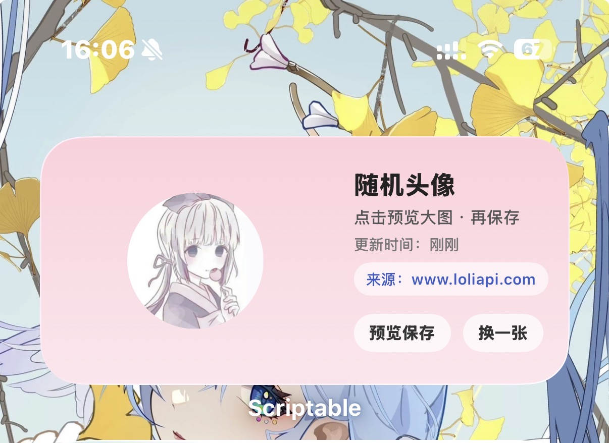
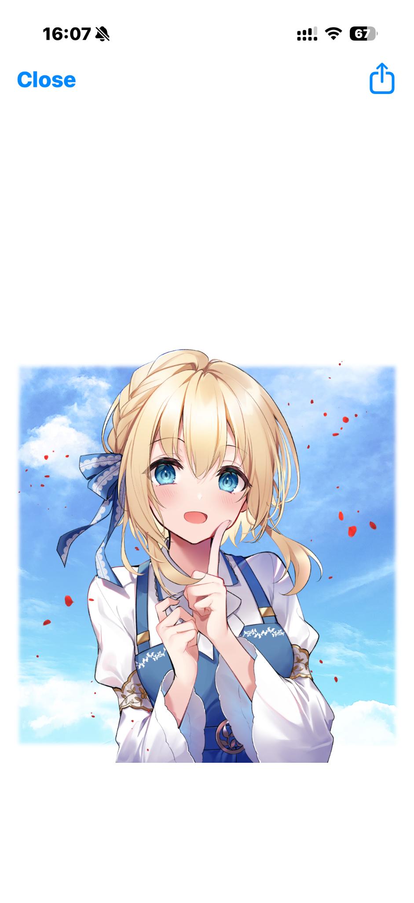
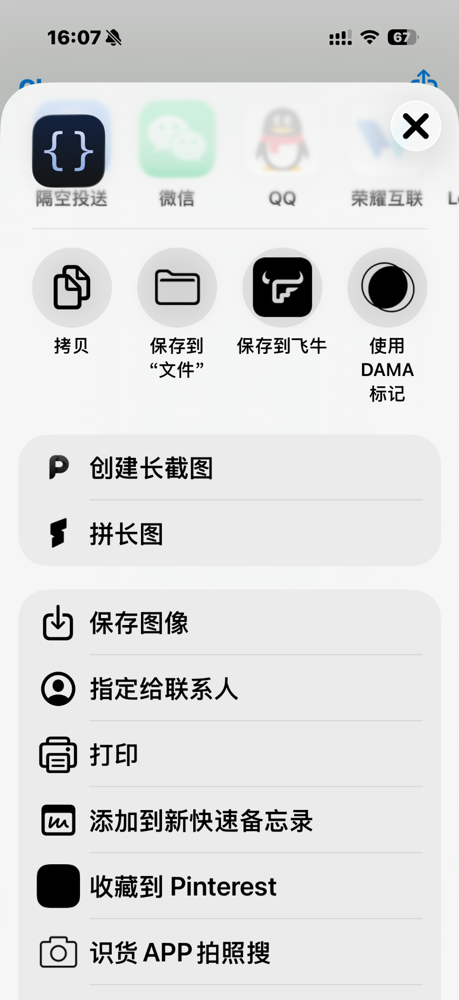
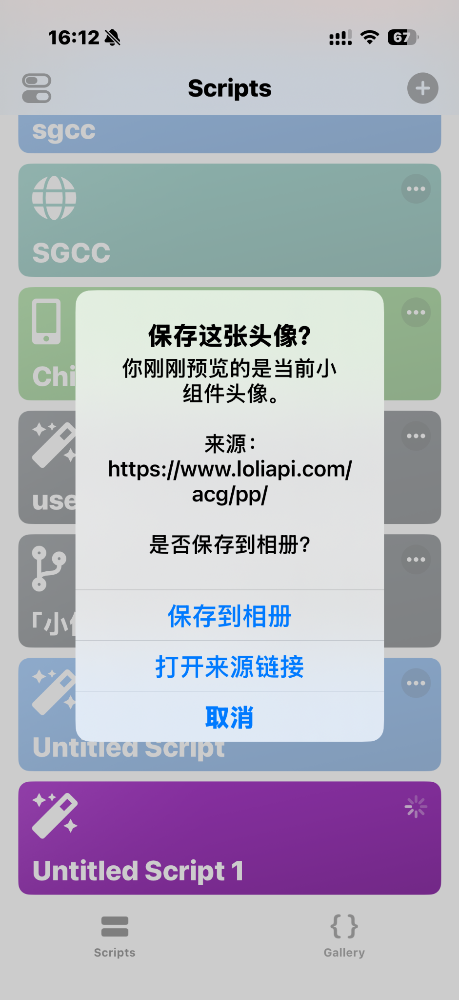
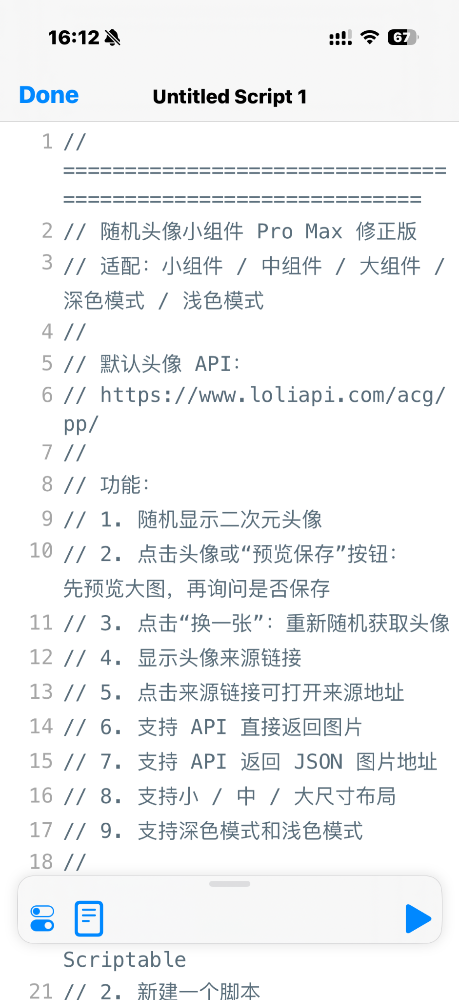

# 🎀 Scriptable Random Avatar Widget

> 一个适用于 iOS Scriptable 的随机二次元头像小组件，支持小 / 中 / 大尺寸、深色模式、头像来源链接、大图预览与保存到相册。


---

## ✨ 项目介绍

这是一个基于 **Scriptable** 制作的 iOS 桌面随机头像小组件。

它可以通过填写头像 API，自动随机显示二次元头像，并支持点击小组件进行 **大图预览、保存到相册、查看来源链接、更换头像** 等操作。

默认使用的头像 API：

```text
https://www.loliapi.com/acg/pp/
```

你也可以替换成自己的随机头像 API。

---

## 📸 效果预览

。

### 桌面小组件效果



---

### 点击头像后预览大图



---

### iOS 分享 / 保存菜单



---

### 保存确认弹窗



---

### Scriptable 脚本界面



---

## 🚀 功能特点

- ✅ 随机显示二次元头像
- ✅ 支持小 / 中 / 大尺寸小组件
- ✅ 支持深色模式 / 浅色模式
- ✅ 点击头像可预览大图
- ✅ 预览后可选择保存到相册
- ✅ 显示头像来源链接
- ✅ 点击来源链接可打开来源地址
- ✅ 点击按钮可更换随机头像
- ✅ 支持 API 直接返回图片
- ✅ 支持 API 返回 JSON 图片地址
- ✅ 带缓存机制，接口异常时不会覆盖原头像
- ✅ 新手友好，复制脚本即可使用

---

## 🧰 准备工作

使用前你需要准备：

1. 一台 iPhone
2. 安装 **Scriptable App**
3. 一个可用的头像 API
4. 本仓库里的脚本文件

Scriptable 可以在 App Store 搜索安装。

---

## 📦 使用方法

### 1. 下载脚本

你可以直接复制仓库中的脚本文件，例如：

```text
random-avatar-widget.js
```

也可以在 GitHub 页面点击文件后，复制完整代码。

---

### 2. 打开 Scriptable

打开 iPhone 上的 **Scriptable**，点击右上角 `+` 新建脚本。

---

### 3. 粘贴代码

把脚本代码完整粘贴进去。

建议脚本名称设置为：

```text
随机头像小组件
```

或者：

```text
Random Avatar Widget
```

---

### 4. 添加桌面小组件

回到 iPhone 桌面：

1. 长按桌面空白处
2. 点击左上角 `+`
3. 搜索 `Scriptable`
4. 选择小 / 中 / 大尺寸
5. 添加到桌面
6. 长按小组件
7. 点击 **编辑小组件**
8. 选择刚刚创建的脚本

---

## ⚙️ API 配置说明

脚本默认使用：

```javascript
const AVATAR_API = "https://www.loliapi.com/acg/pp/";
```

这个 API 是 **直接返回图片** 类型，所以配置如下：

```javascript
const API_RETURNS_JSON = false;
```

---

## 🖼️ 如果你的 API 直接返回图片

例如打开 API 后直接显示一张图片：

```javascript
const AVATAR_API = "https://www.loliapi.com/acg/pp/";
const API_RETURNS_JSON = false;
const JSON_IMAGE_KEY = "url";
```

---

## 🧾 如果你的 API 返回 JSON

如果你的 API 返回内容类似这样：

```json
{
  "url": "https://example.com/avatar.jpg"
}
```

则需要这样设置：

```javascript
const AVATAR_API = "你的 JSON API 地址";
const API_RETURNS_JSON = true;
const JSON_IMAGE_KEY = "url";
```

如果 JSON 是嵌套结构：

```json
{
  "data": {
    "url": "https://example.com/avatar.jpg"
  }
}
```

则这样设置：

```javascript
const JSON_IMAGE_KEY = "data.url";
```

---

## 📱 小组件尺寸说明

### 小尺寸

适合放在桌面角落，显示内容较紧凑：

- 头像
- 来源入口
- 预览按钮
- 换一张按钮

### 中尺寸

推荐日常使用，信息展示比较均衡：

- 左侧显示头像
- 右侧显示标题
- 更新时间
- 来源链接
- 预览保存按钮
- 换一张按钮

### 大尺寸

适合展示效果，界面更完整：

- 大头像
- 状态信息
- 更新时间
- 来源链接
- 操作按钮

---

## 🌙 深色模式支持

脚本会自动识别系统外观：

- 浅色模式：粉色柔和背景
- 深色模式：深色卡片背景
- 文字、按钮、来源链接会自动切换颜色

不需要手动修改。

---

## 💾 保存头像说明

点击头像或点击 **预览保存** 按钮后，会执行以下流程：

1. 打开头像大图预览
2. 关闭预览后弹出确认窗口
3. 可选择：
   - 保存到相册
   - 打开来源链接
   - 取消

第一次保存图片时，iOS 可能会请求相册权限，允许即可。

---

## 🔗 来源链接说明

脚本会在小组件中显示头像来源。

需要注意：

如果 API 是直接返回随机图片，比如：

```text
https://www.loliapi.com/acg/pp/
```

那么来源链接会显示该 API 域名。

由于这是随机图片接口，所以你再次打开来源链接时，可能会随机到另一张图片。

如果你想显示精确的图片地址，建议使用返回 JSON 图片 URL 的 API。

---

## ❓ 常见问题

### 为什么点“换一张”后桌面没有马上变化？

这是 iOS 小组件刷新机制导致的。

脚本已经更新了缓存，回到桌面后等待几秒，或者重新进入桌面，一般就会刷新。

---

### 为什么保存失败？

常见原因：

1. Scriptable 没有相册权限
2. 当前头像还没有成功缓存
3. iOS 权限弹窗没有允许

可以去：

```text
设置 → Scriptable → 照片
```

允许访问照片。

---

### 为什么头像加载失败？

常见原因：

1. 网络异常
2. API 暂时不可用
3. API 返回的不是图片
4. API 不支持随机参数
5. JSON 字段配置错误

如果接口不支持随机参数，可以把脚本里的：

```javascript
const ENABLE_CACHE_BUST = true;
```

改成：

```javascript
const ENABLE_CACHE_BUST = false;
```

---

### 为什么来源链接打开后不是当前头像？

因为默认 API 是随机图片接口。

每次打开：

```text
https://www.loliapi.com/acg/pp/
```

都有可能返回不同图片。

这是接口特性，不是脚本错误。

---

## 📂 推荐仓库结构

```text
scriptable-random-avatar-widget/
├── README.md
├── random-avatar-widget.js
├── assets/
│   ├── preview-widget.jpg
│   ├── preview-large.png
│   ├── share-save.png
│   ├── save-alert.png
│   └── script-editor.png
└── LICENSE
```

---

## 🖼️ 截图文件命名建议

你可以把截图按下面这样重命名：

| 文件名 | 用途 |
|---|---|
| `assets/preview-widget.jpg` | 桌面小组件效果图 |
| `assets/preview-large.png` | 大图预览效果 |
| `assets/share-save.png` | iOS 分享 / 保存菜单 |
| `assets/save-alert.png` | 保存确认弹窗 |
| `assets/script-editor.png` | Scriptable 脚本编辑界面 |

---

## 📝 更新日志

### v1.0.0

- 初始版本发布
- 支持随机头像显示
- 支持小 / 中 / 大尺寸
- 支持深色模式
- 支持头像预览
- 支持保存到相册
- 支持来源链接显示
- 默认接入 LoliAPI 随机二次元头像接口

---

## ⚠️ 免责声明

本项目仅用于 Scriptable 小组件学习、桌面美化和个人使用。

头像图片来源于用户自行配置的第三方 API，本项目不存储、不分发、不拥有相关图片资源。

如果你使用第三方图片 API，请自行确认其使用规则、版权说明和访问限制。

请勿将本项目用于侵犯他人版权、肖像权或其他权益的用途。

---

## 👤 作者

**暖暖**

- 个人博客：<https://www.nuan1145.eu.cc/>
- 工具导航：<https://tools.nuan1145.eu.cc/>
- Telegram 频道：<https://t.me/NUAN114514>
- Telegram 群聊：<https://t.me/MSC4652>
- YouTube：<https://www.youtube.com/@msc6392>
- GitHub：<https://github.com/MSCNUAN>

---

## ⭐ 支持一下

如果这个项目对你有帮助，欢迎点一个 Star。

也欢迎 Fork 后改成你自己的头像 API、小组件样式或桌面主题。
---

## 📢 关注我 & 实用资源推荐

这里汇总了我的联系方式以及我亲测好用的工具与服务，欢迎自取！

### ✈️ 关注我的 Telegram

* **频道 (资源发布/动态)**：【👉 [点击订阅](https://t.me/NUAN114514)】
* **群组 (吹水/交流)**：【💬 [点击加入](https://t.me/MSC4652)】

---

### 🧰 自用工具 & 资源库

* **📦 个人资源站 (综合导航)**：【👉 [点此访问](https://nuannuan-tools.vercel.app/)】
* **☁️ PikPak 磁力下载**：【⚡️ [点击注册](https://mypikpak.com/drive/activity/invited?invitation-code=66396543)】
* **📂 123 网盘资源**：【📂 [点击查看](https://www.123684.com/s/R2hjVv-6Pg13) 】*(提取码: NUAN)*
* **🔧 自用内网穿透工具**：【👉 [立即试用](https://www.cpolar.com/?channel=0&invite=6DaX)】

### 🛒 流量 & 账号服务

* **📶 正规运营商流量卡**：【📶 [点击下单](https://bankala.cn/s/f25188b9)】
* **💳 Bitget Wallet (免费外币卡)**：【👉 [点击申请](https://web3.bitget.com/share/1gWULE?inviteCode=NUAN1145)】
* **🔶 币安 (Binance) 交易所**：【💰 [注册领新手礼](https://www.bmwweb.academy/referral/earn-together/refer2earn-usdc/claim?hl=zh-TC&ref=GRO_28502_RAE9X&utm_source=default)】
* **🍎 Apple ID / 充值卡 / 代理**：【🍎 [购买链接](https://goso002.com/?from=24529)】
* **🌍 海外账号 / AI / 流媒体 / 游戏**：【🛍️ [购买链接](https://accboyytbnn.acceboy.com/)】

### 🚀 网络加速

* **🌐 自用机场推荐**：【🌐 [查看详情](https://t.me/NUAN114514/5)】

---

> ⚠️ **提示**：部分资源链接可能随时间失效，请以我的 TG 频道最新动态为准。
